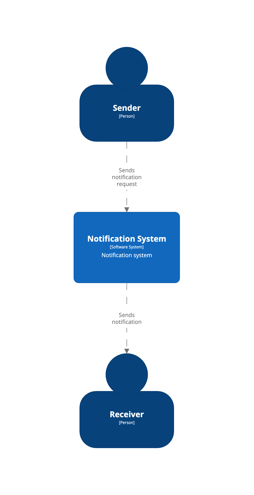
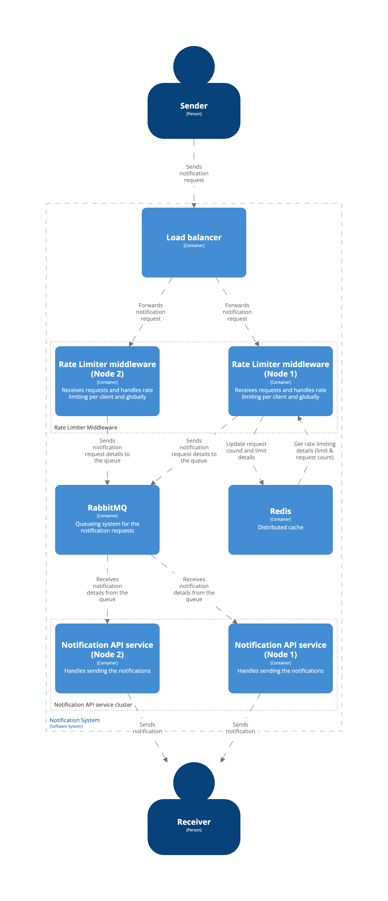
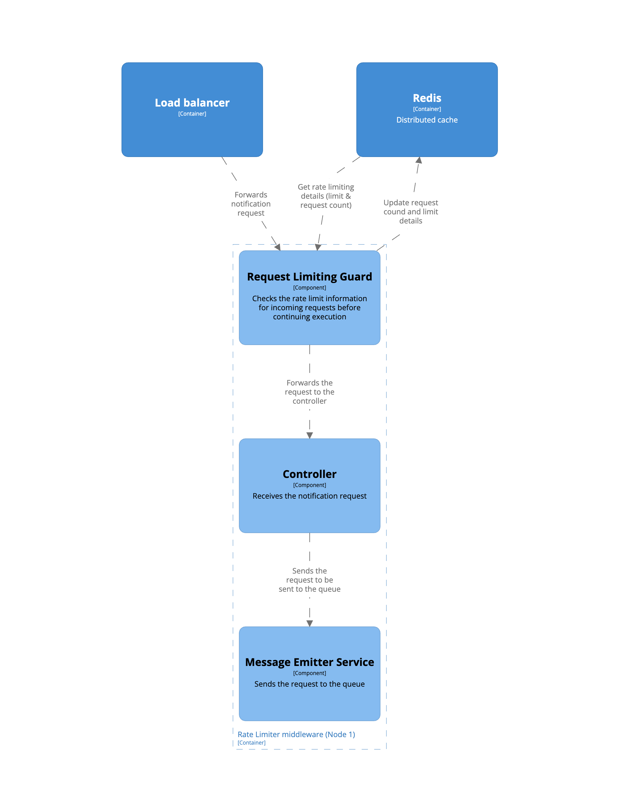
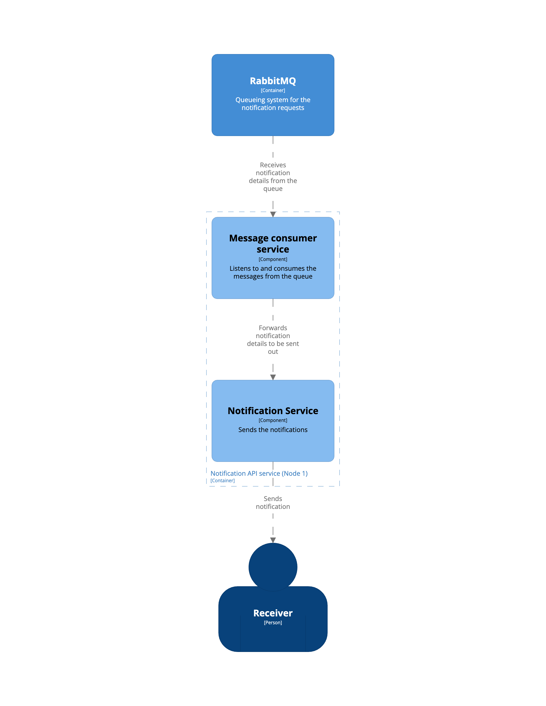

# Notification System Rate Limiting

## Introduction

The Notification Service Rate Limiting system is designed to handle rate limiting for sending SMS and email notifications to clients. The system ensures that the number of requests from clients is controlled within specified limits to maintain system performance and prevent abuse. The solution is built using NestJS, Redis for caching, and RabbitMQ for queuing requests.

## System Overview

The system architecture consists of the following components:

- Notification API server: Exposes the notification service API and handles sending the notifications.
- Rate Limiter Middleware: Enforces rate limits on incoming requests, tracking and limiting the request rate per client and globally across the system.
- Redis Cache: Stores request counts and client-specific rate limit information.
- RabbitMQ: Queues requests that exceed the rate limits for processing at a slower rate.
- Consumer: Consumes requests from the RabbitMQ queue and processes them in the background (Included in the notification API server).

## System architecture - C4 Model

### System context

### Containers

### Rate Limiter Middleware - Components

### Notification API Server - Components

The system follows a distributed setup, with multiple API servers, a shared Redis cache, and a RabbitMQ cluster. Each component plays a specific role in enforcing rate limits and handling requests.

### Rate Limiter Middleware

The Rate Limiter Middleware is integrated into the API servers and is responsible for enforcing rate limits. It operates in the following manner:

- Upon receiving a request, the middleware checks the client's rate limit status by querying the Redis cache.
- If the client has exceeded the rate limit for the specified time window, the request is rejected, and an appropriate response (e.g., 429 Too Many Requests) is sent back to the client.
- If the rate limit is not exceeded, the middleware allows the request to proceed to the corresponding API endpoint.

### Redis Cache

The Redis cache is used to store rate limit information and request counts. It maintains the following data:

- Client rate limit information, including the maximum allowed requests per month.
- Request counts for each client within the specified time window.
- Global request count to enforce overall rate limits across the system.

The Redis cache is distributed and shared among multiple API servers. Atomic increment operations are used to update and retrieve request counts efficiently.

### RabbitMQ

RabbitMQ is used to queue notification requests. When a request comes in, it is enqueued in RabbitMQ for processing later.

### Consumer

The Consumer component is responsible for consuming requests from the RabbitMQ queue and processing them. It operates as follows:

- The Consumer continuously listens to the RabbitMQ queue for new requests.
- When a request arrives, it is fetched from the queue and processed.
- The processing may involve sending the notification, updating relevant data, and performing any required actions.
- Once processing is complete, the request is acknowledged and removed from the queue.

### Notification API Server

This is responsible for sending out the notifications requested by the clients.

- It includes in itself the Consumer component which listens to the queue.
- When a request is received from the queue, it then uses it to send the notification for that request.

## Scalability and Performance Considerations

To ensure scalability and handle high request volumes, the following considerations are taken into account:

- Load Balancing: Multiple Notification API servers can be deployed behind a load balancer to distribute incoming requests across the cluster, enabling horizontal scaling.
- Caching: Redis is used as a distributed cache to store rate limit information, minimizing the need for frequent database queries and enhancing performance.
- Asynchronous Processing: All Requests are queued in RabbitMQ for asynchronous processing by the Consumer, allowing the system to handle bursts of requests efficiently.
- Distributed Messaging: RabbitMQ cluster ensures fault tolerance and high availability for message queuing and processing.

- Monitoring and Metrics: Implementing monitoring tools and collecting metrics helps identify performance bottlenecks, track request rates, and monitor system health.

## Local Setup & Usage

The local setup is a simplified setup using docker with 2 rate limiter containers, 2 notification api containers, a redis database container and a rabbitmq container.

### Running manually

- Run `docker-compose up redis rabbitmq`
- Go to the `rate-limiter` directory, rename .env.sample to .env and run `npm run start:dev'
- Repeat the previous step in the 'notification-api` directory

### Running with docker-compose

- Run `docker-compose up`
- The notification api containers run on ports 4001 and 4002
- The rate limiter containers run on ports 3001 and 3002

## Conclusion

The Notification Service Rate Limiting system effectively handles rate limiting for SMS and email notifications. By leveraging NestJS, Redis, and RabbitMQ, the system enforces rate limits on a per-client and global basis, ensuring system performance, preventing abuse, and queuing requests that exceed rate limits for controlled processing. The distributed setup allows for scalability, fault tolerance, and efficient handling of high request volumes.
